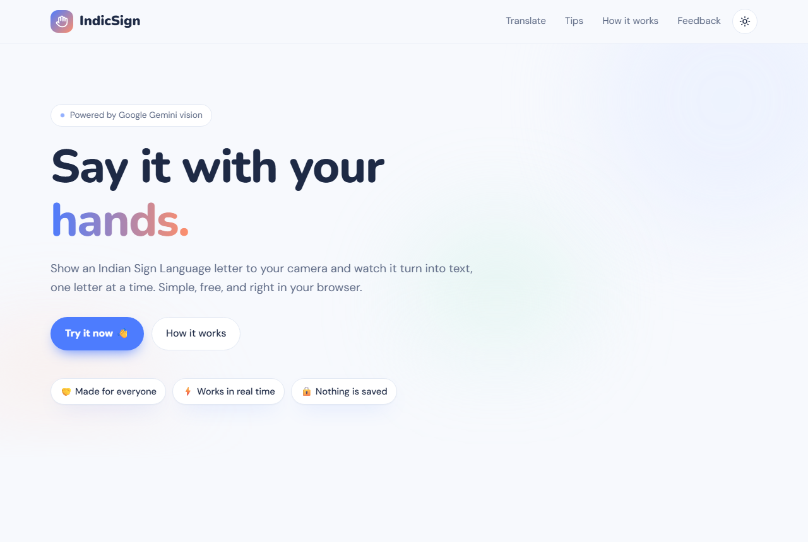
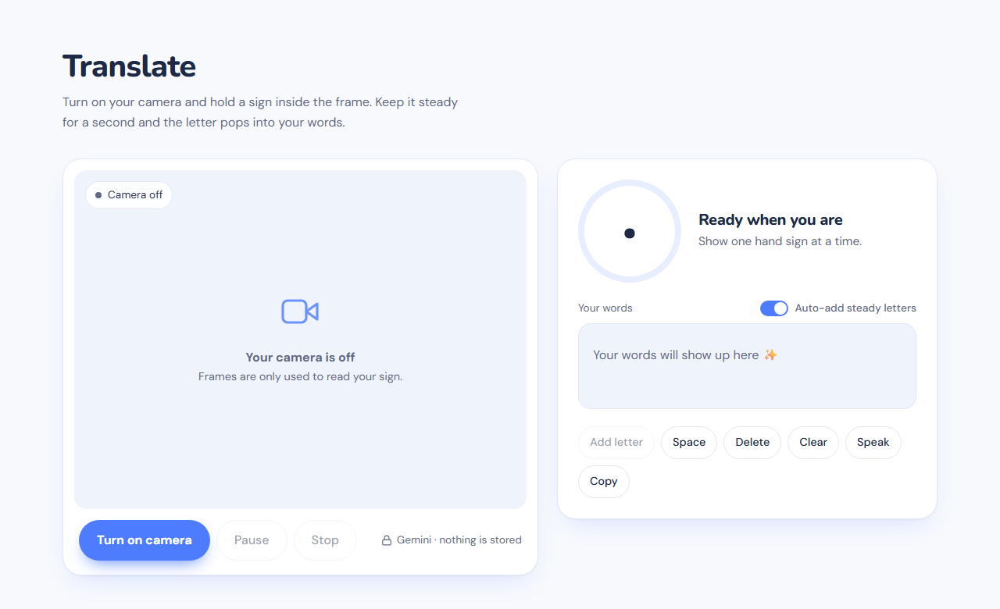
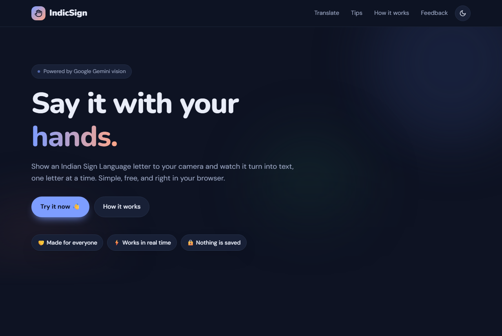
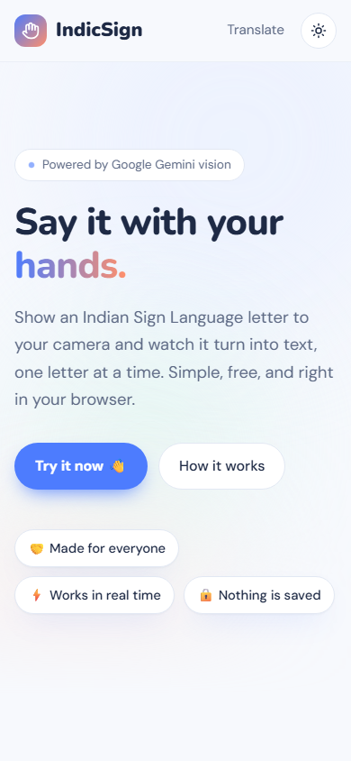
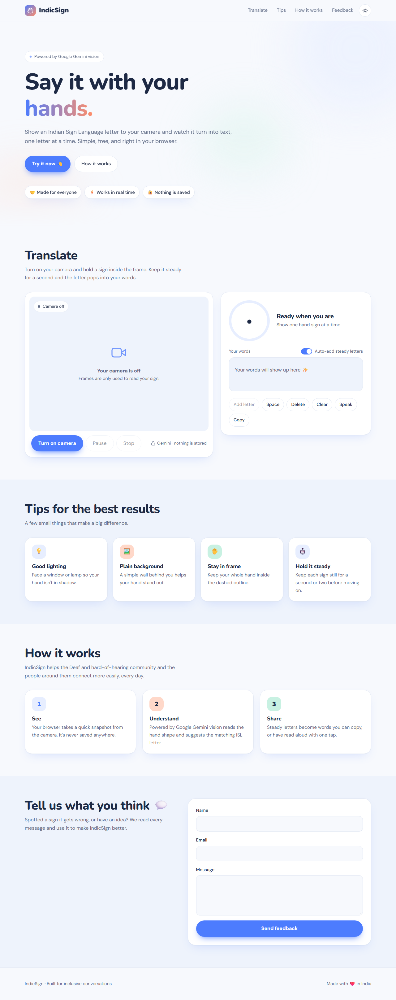

# ✋ IndicSign: Indian Sign Language Recognition

**Say it with your hands.** IndicSign turns Indian Sign Language (ISL) alphabet signs into text in real time, right from your webcam, to make everyday conversations easier for the Deaf and hard-of-hearing community and the people around them.

<p align="center">
  
</p>

🌐 **Live demo:** https://ridhi-sign-language-gemini.onrender.com &nbsp;·&nbsp; 🎥 **Video:** https://www.youtube.com/watch?v=d3Ol355ZQiQ

---

## 📸 Screenshots

| Translate | Dark mode |
|---|---|
|  |  |

| Mobile | Full page |
|---|---|
|  |  |

---

## ✨ Features

- 🔤 **Real-time ISL alphabet recognition** from your webcam
- 🧠 **Steady-letter detection:** a letter is added once it's held for a moment, so words build up naturally
- ✍️ **Your words panel** with Space, Delete, Clear, **Copy** and **Speak** (reads your words aloud)
- 📊 **Confidence ring** showing how sure the model is
- 🌗 **Light & dark mode**, mobile-friendly, respects *reduced motion*
- 🔒 **Private by design:** frames are only used to read the sign and are never stored
- 💬 Built-in feedback form

---

## 🔀 Two versions

| | 🤖 **Gemini version** (recommended) | 🧠 **On-device ML version** |
|---|---|---|
| Folder | [`sign_language_gemini-main/`](sign_language_gemini-main) | [`indicSign_mlmodel/`](indicSign_mlmodel) |
| How it works | Sends a small snapshot to Google Gemini vision | MediaPipe hand landmarks + Random Forest classifier |
| Needs | A free Gemini API key | No key, runs fully locally |
| Accuracy | Strong, no training needed | ~89% on the custom dataset |

Both versions share the same web interface.

---

## 🚀 Quick start (Gemini version)

```bash
cd sign_language_gemini-main
python -m venv .venv
.venv\Scripts\activate            # macOS/Linux: source .venv/bin/activate
pip install -r requirements.txt
copy .env.example .env            # macOS/Linux: cp .env.example .env
```

Open `.env` and paste your key from **https://aistudio.google.com/apikey**:

```env
GEMINI_API_KEY=your-key-here
# optional: GEMINI_MODEL=gemini-3.5-flash
```

Then run:

```bash
python app.py
```

and open **http://127.0.0.1:5000**. Click **Turn on camera**, hold a sign inside the frame, and watch the letters appear.

### ☁️ Deploying (Render, Railway, etc.)
- **Build command:** `pip install -r requirements.txt`
- **Start command:** `gunicorn app:app`
- **Environment variable:** `GEMINI_API_KEY`

---

## 🧠 Quick start (on-device ML version)

```bash
cd indicSign_mlmodel
python -m venv .venv
.venv\Scripts\activate
pip install -r requirements.txt   # use Python 3.10 – 3.12
python app.py                     # http://127.0.0.1:5001
```

**Train your own model:**

| Step | Script | What it does |
|---|---|---|
| 1 | `collect_imgs.py` | Captures webcam images for each letter (A–Z) into `data/` |
| 2 | `create_dataset.py` | Extracts MediaPipe hand landmarks → `data.pickle` |
| 3 | `trainclassifier.py` | Trains a Random Forest → `model.p` |
| 4 | `test_classifier.py` | Live test window with predictions drawn on the video |

---

## 🛠️ What's new in this update

- **Fixed the "Gemini API error".** The app was calling `gemini-1.5-flash`, which Google has shut down. It now uses `gemini-3.5-flash-lite` by default and **automatically falls back** to other current models if one is busy, rate-limited or unavailable.
- **Fixed the API key not loading.** `requirements.txt` listed `dotenv` instead of `python-dotenv`.
- **Clear error messages** in the UI (missing/invalid key, rate limit, busy service) with automatic back-off and retry.
- **Structured responses** from Gemini (letter + confidence + hand visible), so no more random text as predictions.
- **Brand-new interface:** bright, friendly design with light/dark mode, word builder, text-to-speech and copy.
- **ML version:** fixed the page calling the server before the camera started, removed the unused server-side camera stream, made MediaPipe thread-safe, added confidence scores and pinned compatible package versions.
- API key moved to the `x-goog-api-key` header, and `.env` is now git-ignored.

---

## 🧰 Tech stack

**Backend:** Python, Flask, Gunicorn · **AI:** Google Gemini API, MediaPipe, scikit-learn · **Frontend:** HTML, CSS, vanilla JavaScript

## 🎯 Applications

- Real-time communication aid for the hearing and speech impaired
- Learning and practising ISL fingerspelling
- Accessible kiosks in public spaces and customer service

---

<p align="center">Made with ❤️ in India, for inclusive conversations.</p>
